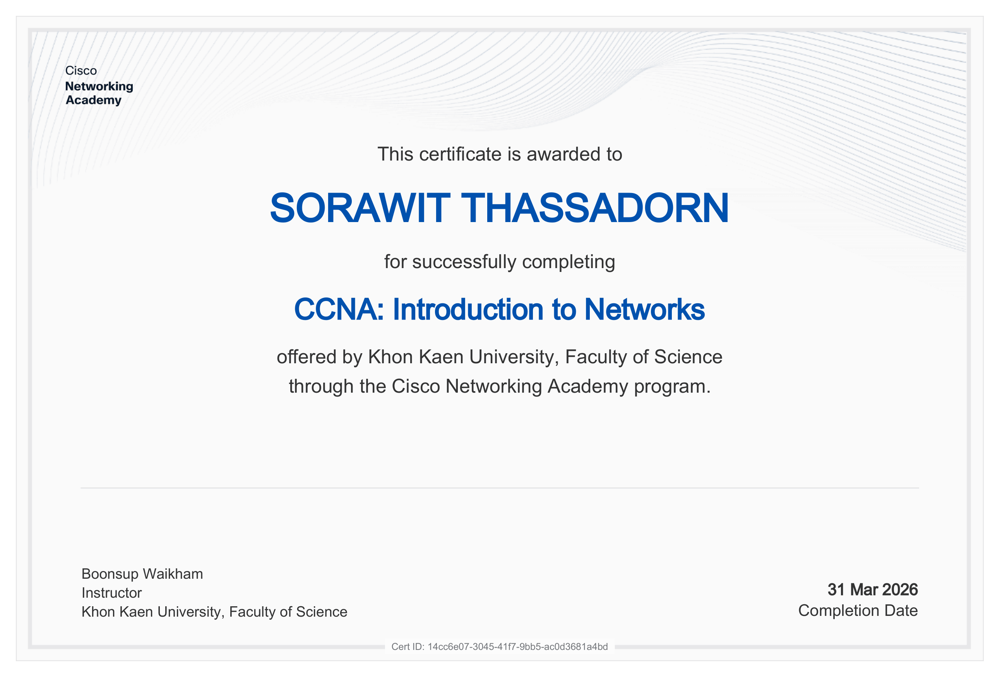
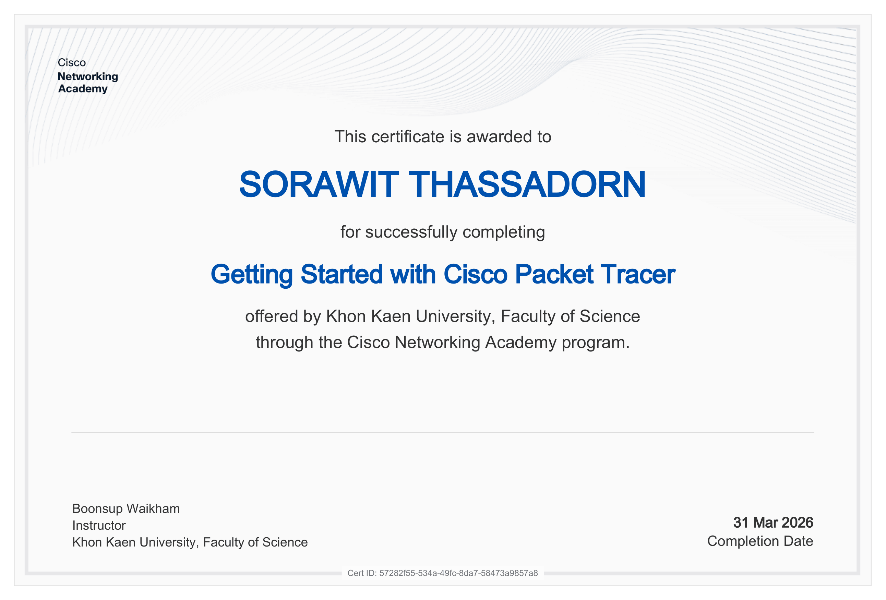
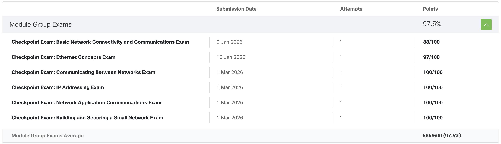

# 🌐 Network Portfolio

Welcome to my Networking Portfolio. This repository showcases my academic progress, laboratory workshops, and professional certifications in the field of networking and computer systems.

---

## 👨‍🎓 Student Profile

> **Name:** สรวิชญ์ ทัศดร (Sorawit Thassadorn)
>
> **Student ID:** 673380065-6

---

## 🏆 Professional Certificates & Achievements

I have successfully completed several Cisco Networking Academy courses to build a strong foundation in networking concepts and practical skills.

<table>
    <tr>
    <td>
      
      </td>
      <td>
      
      </td>
    </tr>
</table>

  <b>CCNA: Introduction to Networks (ITN)</b> &nbsp; | &nbsp; <b>Cisco Packet Tracer</b>

---

## 📊 Course Performance

Overview of my progress and module completion.

---

## 📝 Personal Assignments

Independent research and practical tasks focusing on fundamental and advanced networking concepts.

- [📄 Personal Essay](https://docs.google.com/document/d/1tgZ5qS17CIR2WBM_1Z-PTK5P3Qtvj5YZTOLJNz8tbkc/edit?usp=sharing) - Reflections and goals in networking.
- [🗺️ Network Topology](https://docs.google.com/document/d/1TTckerWswtvwc7KKslM9W44YnAw7vLSUq3KCFj5VW-o/edit?usp=sharing) - Designing efficient network structures.
- [📁 Not Simple Project](https://drive.google.com/file/d/1x0YUUdEXlRkx2QlPeBAFSrkDu5UaB0Lg/view?usp=sharing) - Advanced implementation tasks.
- [🔌 TCP vs UDP Comparison](https://docs.google.com/document/d/1TvRQ_q9Gi8Sg2aDc1rs2yItFNWlX1hYrzsQmhfszGYM/edit?usp=sharing) - Deep dive into transport layer protocols.
- [🧪 Lab 5](#) - Practical application (In progress).

---

## 🤝 Workshop Group Projects

Collaborative laboratory exercises and team-based network implementations.

| Lab / Task             | Documentation                                                                                                |
| :--------------------- | :----------------------------------------------------------------------------------------------------------- |
| **Lab 1**              | [View Doc](https://docs.google.com/document/d/1LTyeTCxfYjoqUJnsBHURvWGh1Y410z-8Ah7sDqklG1c/edit?usp=sharing) |
| **Lab 2**              | [View Doc](https://docs.google.com/document/d/1BMCTrAFfA2mMvrydhwGSf1R466rwE9007YExsYK6FT8/edit?usp=sharing) |
| **Lab 3**              | [View Doc](https://docs.google.com/document/d/1ay9XhTljggX9RlXcrCvseNOeFKb2ts6Vrp4NaN4QIF8/edit?usp=sharing) |
| **Lab 4**              | [View Doc](https://docs.google.com/document/d/1MURDTx2FsTknknAwdjMUKIodGjyuBXNKRkQBv0g-u0M/edit?usp=sharing) |
| **New Network Design** | [Drive Folder](https://drive.google.com/drive/folders/1MyOYWLl1D9psgolZ1Y_Tp7nPIAeupHDz?usp=sharing)         |
| **Sprint Alpha**       | [Drive Folder](https://drive.google.com/drive/folders/1ejW6vdKICTaLfQ-hjtxQ_FZ4tm3Ojcpy?usp=sharing)         |

---

## 💻 Class Workshop

Additional individual work and code implementations from the network class.

- [📂 Network Class Repository](https://github.com/B-bsw/network-class.git)

---

## 🚀 Key Projects

Major networking project encompassing all learned technologies.

- [📂 Project Folder](https://drive.google.com/drive/folders/1JaiOpJeRT33JaBn1Av1e7NAkkaVtYpW-?usp=sharing)

---

© 2024 สรวิชญ์ ทัศดร. All rights reserved.
